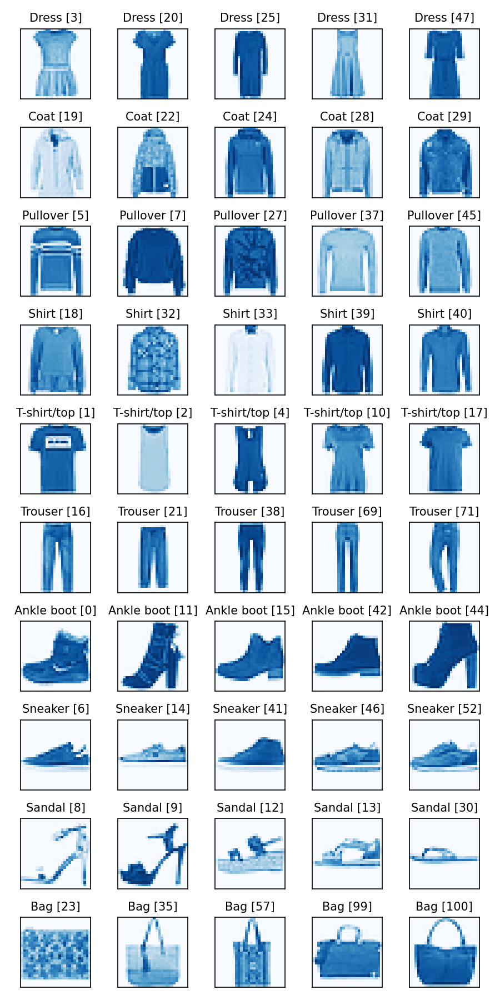
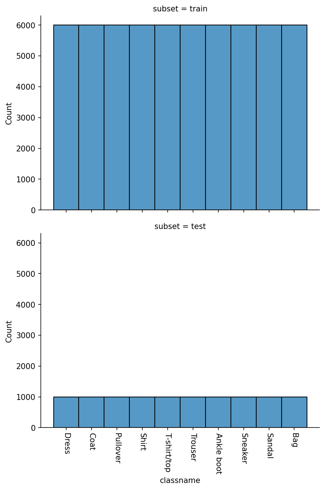
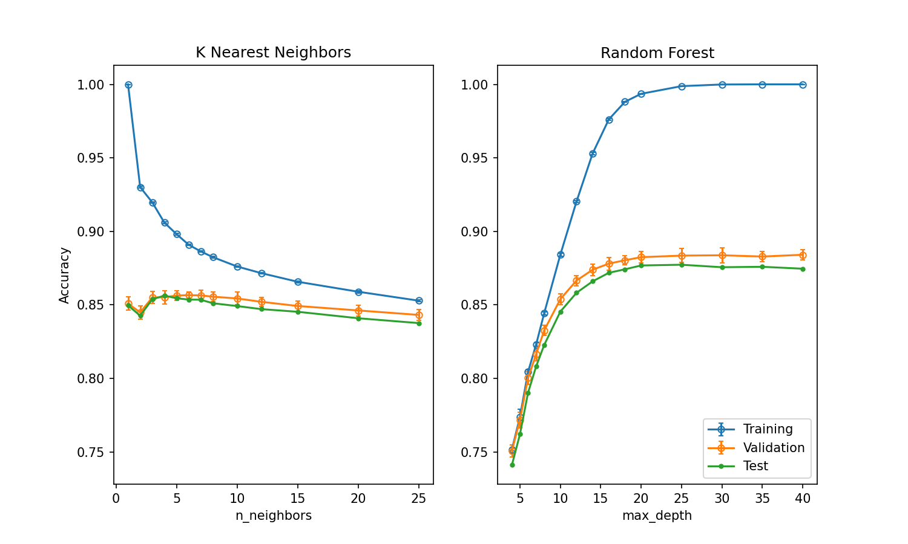
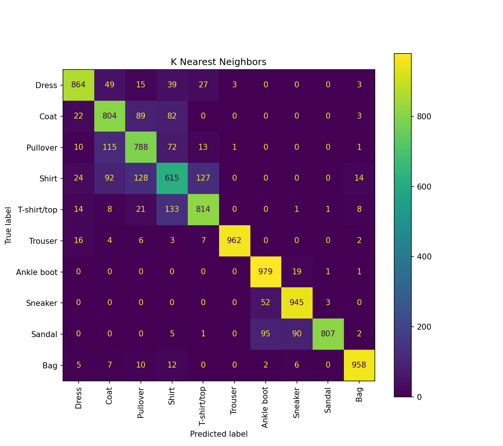
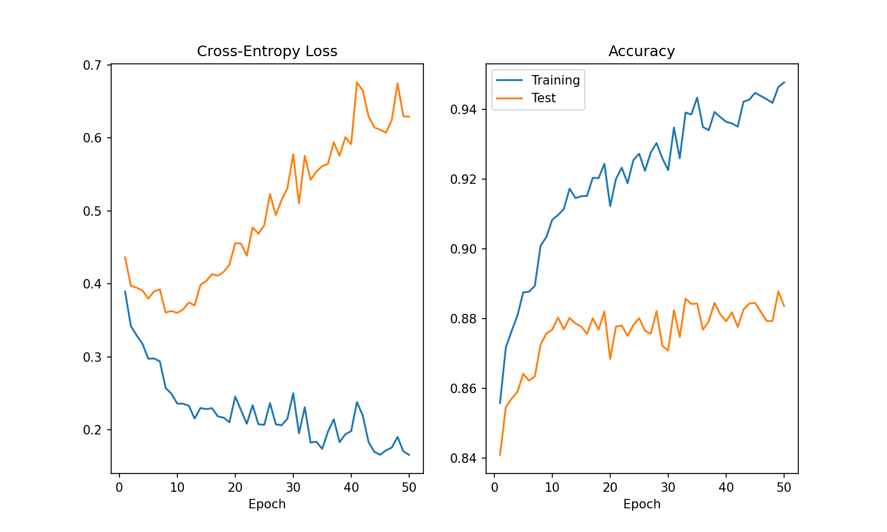
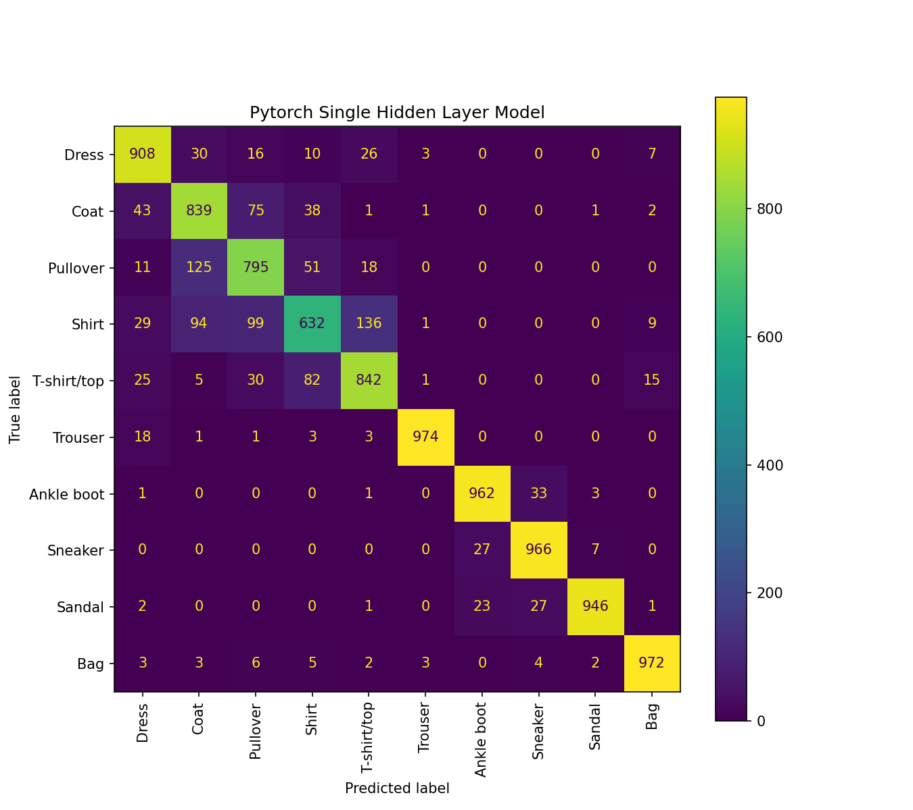

# Objective

Demonstrate use of the pytorch framework in a basic image classification problem.

# Source Code Components

The demonstration consists of one script:

- **[pytorch_FashionMNIST.py](pytorch_FashionMNIST.py):** Runs baseline machine learning classifier algorithms from scikit-learn, then runs an elementary pytorch neural network model with just a single hidden layer, and compares output results.

# Dependencies

There are 6 python package dependencies that must be installed before running the demo:

- [numpy](https://numpy.org/)
- [pandas](https://pandas.pydata.org/)
- [matplotlib](https://matplotlib.org/)
- [seaborn](https://seaborn.pydata.org/)
- [scikit-learn](https://scikit-learn.org/stable/)
- [pytorch](https://pytorch.org/)

# Data

The demonstration uses the [FashionMNIST](https://pytorch.org/vision/stable/generated/torchvision.datasets.FashionMNIST.html) data set that's distributed with pytorch as a standard test package.  The data set consists of 70,000 28×28 pixel images of labeled garments and accessories in 10 classes:

- Tops
    * Dress
    * Coat
    * Pullover
    * Shirt
    * T-shirt/top
- Bottoms
    * Trouser
- Shoes
    * Ankle boot
    * Sneaker
    * Sandal
- Accessories
    * Bag

Here are 5 sample images from each class:

The data set is predivided into a standard training and test split containing 60,000 and 10,000 images, respectively.  Membership is evenly distributed across all classes:

# Data Analysis

## Scikit-Learn Baseline Performance Estimation

Before building a neural network model using pytorch, a baseline performance calculation is attempted, using two popular machine learning classifier models from the scikit-learn framework, [K Nearest Neighbors](https://scikit-learn.org/stable/modules/generated/sklearn.neighbors.KNeighborsClassifier.html) and [Random Forest](https://scikit-learn.org/stable/modules/generated/sklearn.ensemble.RandomForestClassifier.html).

### Hyperparameter Tuning

These models both have hyperparameters which offer the user an opportunity to fine tune how the models behave.  As an exercise, we attempt to optimize along one hyperparameter for each model, accepting default values for all other model hyperparameters:

- K Nearest Neighbors: we vary the `n_neighbors`, the number of neighbor images that are used to vote on a classification decision 
- Random Forest: we vary the `max_depth`, which controls the maximum allowed depth (i.e., the number of decision nodes) of the decision trees in the forest

The 60,000 images in the original pytorch-defined training split are further sub-divided into 10 cross-validation folds each consisting of 54,000 training images and 6000 validation images.  Each model is trained on the 54,000 images in each fold, and the classification accuracy is calculated on both the 54,000 training images (blue trace) and 6000 validation images (orange trace) in that fold.  Error bars below plotted depict the estimated standard deviation of the accuracy observed across the 10 folds.

In a non-demonstration exercise, one would typically choose the single hyperparameter setting corresponding to the best (i.e., highest accuracy) validation result, and then re-train the classifier using all 60,000 training images, and estimate the final predicted accuracy using the 10,000 remaining holdout images (green trace), but only at that optimized hyperparameter value.  One would *not* use the final holdout data to select an optimal hyperparameter setting, as that would be "cheating" essentially; final holdout data should never be used to tune any aspect of model selection.

Here, for demonstration purposes, instead of calculating accuracy against the final holdout test set solely at the optimized hyperparameter value, we actually retrain across all hyperparameter values, just to explore how closely the validation accuracy estimate (orange trace) actually recapitulates the accuracy estimated with the final holdout test data, across the entire range of hyperparameter space.

Several interesting observations come out of this exercise.

First, the Random Forest Classifier notably exhibits overfitting, beginning at roughly a value of `max_depth ≈ 8`.  It's around this point that the training accuracy begins to diverge from the validation and final holdout test accuracy, indicating that the improved performance on the training set is beginning to fail to generalize to new data.  An additional point of interest is that validation and test set performance does continue to improve somewhat for a while after that, although it eventually saturates at a much lower level (roughly ~88%) than the training accuracy, which eventually reaches nearly 100%.

It's also noteworthy that K Nearest Neighbors actually achieves 100% accuracy on the training set with `n_neighbors = 1` .  There's an unexpected reason for this: it's because the specific implementation of this algorithm in scikit-learn apparently has no mechanism to exclude the sample itself from comparison (or equivalently, to exclude functionally identical samples having `distance = 0` after evaluating a distance metric).  So, for `n_neighbors = 1`, on the training set, this means that the algorithm just uses the sample itself as the closest reference example, in 100% of cases.  Even for cases with `n_neighbors > 1`, a sample drawn from the training set will always be compared against itself as one of its neighbors.  Thus, K Nearest Neighbors has an inherent limitation that makes it difficult to use the training data performance to identify "overfitting" in the same way we're able to do with the Random Forest Classifier, because training samples are always guaranteed at least one additional "correct vote" that is not generally available to samples in the test data set.

A final point of interest is that the final accuracy estimates derived from cross-validation seem to be consistently slightly higher than the accuracy estimates from the final holdout test set, across most hyperparameter values.  I surmise this is related to the fact that even though the 10 validation folds used in the cross-validation step are completely independent of one another, the 10 training folds are not: each training fold exhibits 8/9 common sample overlap with its two most similar neighbors, and lesser degrees of sample overlap with the other folds as well.  Thus, there are hidden correlations in the training outcomes across each of the folds, even if the validation sets are each independent statistical draws and do not overlap.

### K Nearest Neighbors Confusion Matrix

A confusion matrix for one of the scikit-learn classifiers, K Nearest Neighbors, shows which classes are the most difficult to distinguish:

Although there are 10 classes in this data set, there are in effect four superclasses: tops, bottoms, shoes, and accessories.  Unsurprisingly, items falling within the same superclass (e.g., different types of tops, different types of shoes) are typically the most likely to be confused for one another, and assigned an incorrect prediction label.

## Pytorch Model

For demonstration purposes, the pytorch model used in this exercise is a relatively simple one, consisting of just one input layer, one output layer, and one hidden layer:

- **Input Layer:** 28×28 = 784 feature inputs (one input per pixel), 512 outputs
- **Hidden Layer:** 512 inputs, 512 outputs
- **Output Layer:** 512 inputs, 10 class outputs

A ReLU activation function is used between all layers to connect the inputs and outputs.

## Pytorch Results

### Cross-Entropy Loss and Accuracy vs. Epoch

The script tests a number of different combinations of learning rate and batch size, eventually selecting the combination with the smallest cross-entropy loss observed in the validation split at the end of three epochs worth of training,.  This combination of learning rate and batch size is "optimal" in the sense that it leads to the fastest overall improvements to performance over the course of the initial 3 epochs worth of training.  Using these optimal values, the model is then retrained for 50 epochs using all of the training data, and the cross-entropy loss as well as accuracy are calculated for both the training and test splits.  Results at the end of each epoch throughout the entire training schedule are plotted below:

A few remarks are warranted.  The cross-entropy loss for the training data looks normal and as expected, starting out around 0.4 by the end of epoch 1 and gradually decreasing to slightly below 0.2.  The cross-entropy loss for the test set on the other hand decreases until around epoch 10, and then surprisingly it begins to rise.  Meanwhile, accuracy for the test set begins to plateau and saturate near ~88% at approximately the same point in the training cycle (epoch 10), while conversely accuracy for the training set continues to rise.  I surmise this is probably another manifestation of overfitting, in which increasing gains realized in terms of perfomance on the training data nevertheless exhibit diminishing returns when extended to the holdout test data.

### Pytorch Confusion Matrix

As with the scikit-learn K Nearest Neighbors classifer, a confusion matrix is plotted:

As noted earlier, the most confusion generally occurs between members within the same superclass; i.e., within tops, or within shoes.

# Conclusions

The demo script, [pytorch_FashionMNIST.py](pytorch_FashionMNIST.py) demonstrates a simple basic pytorch image classification workflow, including baseline results from traditional non-neural network machine learning approaches as well.  For the simple pytorch model that we've built here, with just a single hidden layer, final accuracy on the holdout test data set saturates at around 88%, which delivers approximately equivalent performance as a Random Forest classifer in scikit-learn.  Other, more complicated neural network model architectures (e.g., such as deep learning networks containing multiple hidden layers) could offer further performance gains, however for purposes of developing a simple demo, those more complicated architectures weren't tested here.
